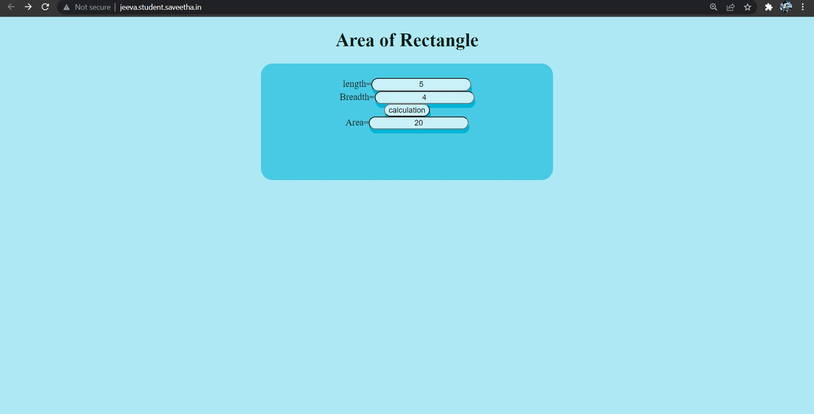

# Design a Website for Server Side Processing

## AIM:
To design a website to perform mathematical calculations in server side.

## DESIGN STEPS:

### Step 1:
Create a django project inside the pulled GitHub Repo.


### Step 2:
Insdie the project create a app called mathapp using command "sudo python3 manage.py startapp mathapp".


### Step 3:
Create a template folder inside mathapp and inside than create another folder called mathapp and inside that create a new file "area.html"


### Step 4:
Add the html conents in the area.html.


### Step 5:
Do the mathemical calculation in views.py and link the html tags.

### Step 6:
Link the html file through views.py in urls.py.

### step 7:
Add mathapp to installed apps in setting.py and add necessary changes.


### Step 8:

Publish the website in the given URL: http://jeeva.student.saveetha.in/

## PROGRAM :
```

# Area.html:
<!DOCTYPE html>
<html>
<head>
    <meta charset='utf-8'>
    <meta http-equiv='X-UA-Compatible' content='IE=edge'>
    <title>Area</title>
    <meta name='viewport' content='width=device-width, initial-scale=1'>
    <link rel='stylesheet' type='text/css' media='screen' href='main.css'>
    <script src='main.js'></script>
  <style>
       body{
            text-align: center;
            background-color: #ade8f4;
            color: #081c15;
        }
        div{
            display: block;
            background-color: #48cae4;
            text-align: center;
            border-radius: 20px;
            width: 500px;
            height: 200px;
            margin-left: auto;
            margin-right: auto;
        }
        form{
            padding-top: 25px;
        }
        input{
            text-align: center;
            border-radius: 20px;
            text-align: center;
            box-shadow: 1.5px 7px #00b4d8;
            background-color: #caf0f8;
        }
        
  </style>
</head>
<body>
    
    <h1>Area of Rectangle</h1>
    <div>
    <form method="POST">
    length=<input type="text" name="length" value="{{l}}"></input><br/>
    Breadth=<input type="text" name="Breadth" value="{{b}}"></input><br/>
    <input type="submit" value="calculation"></input><br/>
    Area=<input type="text"  name="Area" value="{{area}}"></input><br/>
    </form>
    </div>
</body>
</html>

# Views.py:
from django.shortcuts import render

## Create your views here.

def areacalculation(request):
    context = {}
    context["area"] = "0"
    context["l"] = "0"
    context["b"] = "0"
    if request.method == "POST":
        l = request.POST.get("length","0")
        b = request.POST.get("breadth","0")
        area = ((int(l) * int(b)))
        context["area"] = area
        context["l"] = l
        context["b"] = b
    return render(request,'mathapp/area.html',context)
 
# urls.py:
from django.contrib import admin
from django.urls import path
from mathapp import views

urlpatterns = [
    path('admin/', admin.site.urls),
    path('areaofrectangle/',views.areacalculation,name="areaofrectangle"),
    path("",views.areacalculation,name="areaofrectangleroot")
]
```
## OUTPUT:



## Result:
Thus a website is designed to perform mathematical calculations in server side and is hosted at http://jeeva.student.saveetha.in/

